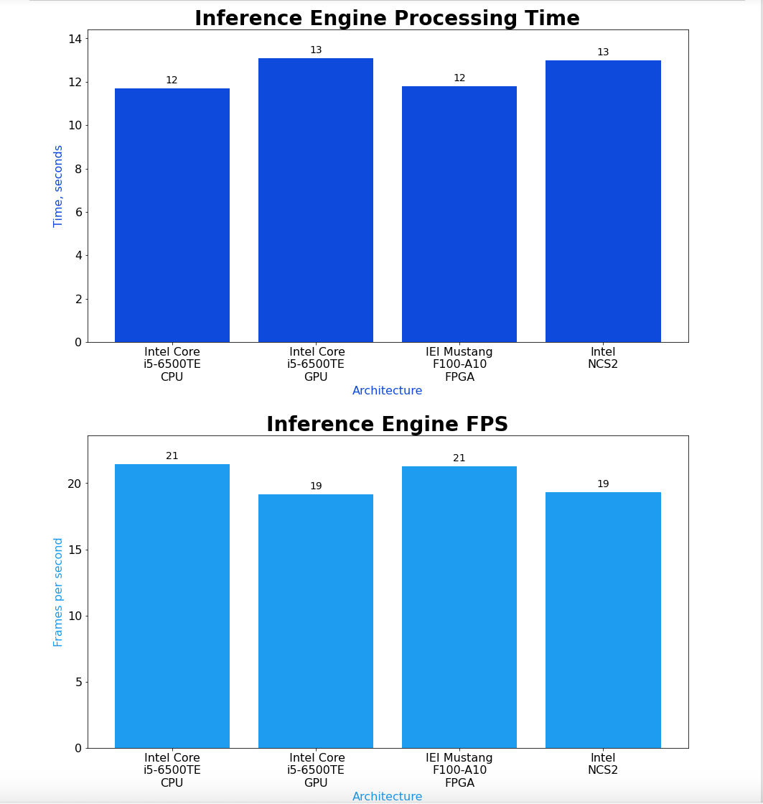

# Computer Pointer Controller

In this project we use a gaze detection model to control the mouse pointer of your computer. Specifically, using a pipeline of a four models we create an application to control the computer mouse with the our face's gaze.
There are four models: Face Detection, head Pose Estimation, Facial Landmarks detection for locating the eyey in the face and lastly, the gaze estimation which gives us the gaze vector for controlling the mouse

## Project Set Up and Installation
*TODO:* Explain the setup procedures to run your project. For instance, this can include your project directory structure, the models you need to download and where to place them etc. Also include details about how to install the dependencies your project requires.

Enable the virtual environment:

```
source /opt/intel/openvino/bin/setupvars.sh
```

Install the requirements:

```
pip install -e requirements.txt
```

We then have to download all the models. We do this on the project's folder. So, cd in the folder and run the following commands:

```
python3 /opt/intel/openvino/deployment_tools/tools/model_downloader/downloader.py --name face-detection-adas-binary-0001

python3 /opt/intel/openvino/deployment_tools/tools/model_downloader/downloader.py --name head-pose-estimation-adas-0001

python3 /opt/intel/openvino/deployment_tools/tools/model_downloader/downloader.py --name landmarks-regression-retail-0009

python3 /opt/intel/openvino/deployment_tools/tools/model_downloader/downloader.py --name gaze-estimation-adas-0002
```

## Demo

For a demo of the app `cd` into the `src` folder first.

Run the following command:

```

python3 main.py -fm ../intel/face-detection-adas-binary-0001/FP32-INT1/face-detection-adas-binary-0001.xml -pm ../intel/head-pose-estimation-adas-0001/FP32/head-pose-estimation-adas-0001.xml -lm ../intel/landmarks-regression-retail-0009/FP32/landmarks-regression-retail-0009.xml -gm ../intel/gaze-estimation-adas-0002/FP32/gaze-estimation-adas-0002.xml -i '../bin/demo.mp4' -o . -d "CPU" -c 0.5

```

## Documentation

For running the app there are a few required arguments and a few optional. The required are the names of the four models ("-fm","-gm","-lm","-gm").
Also, the output directory and the input media (or a camera). To activate the camera instead of entering the path of a video file put `cam`("-i") .
If you want to see intermediate results for each stage of the pipeline, activate the parameter "--visualization", the values are the same as for the model ("-fm","-gm","-lm","-gm").

Also, for the app to work, the video or the camera needs to have a face that's moving its eyes. For the next
versions I plan to accommodate for the various sources of error (A missing face, not looking, etc.)

## Benchmarks

I run the model on 4 different architectures. However, I skipped the part of moving the mouse because
the Intel Dev Cloud account doesn't provide any screens and we're only interested in the inference time and  other statistics:



To run the benchmarks open the file `checkperformance.ipynb`. Note that it uses the file `main-inteldev.py` because I needed
some instructions which are not available locally.

I suggest running the program locally in order to be able to watch the intermediate states of the pipeline on the screen and your mouse.
Moving the mouse is not possible on the intel dev platform so I commented out that code to produce the benchmarks

## Results

The total inference time for all models is similar. I interpret the results on the simplicity of the used models.
If you notice any error on my results please open an issue.

## Standout Suggestions
*TODO (Optional):* This is where you can provide information about any standout suggestions that you have attempted.

### Async Inference
*TODO (Optional):* If you have used Async Inference in your code, benchmark the results and explain its effects on power and performance of your project.

### Edge Cases
*TODO (Optional):* There will be certain situations that will break your inference flow. For instance, lighting changes or multiple people in the frame. Explain some of the edge cases you encountered in your project and how you solved them to make your project more robust.
